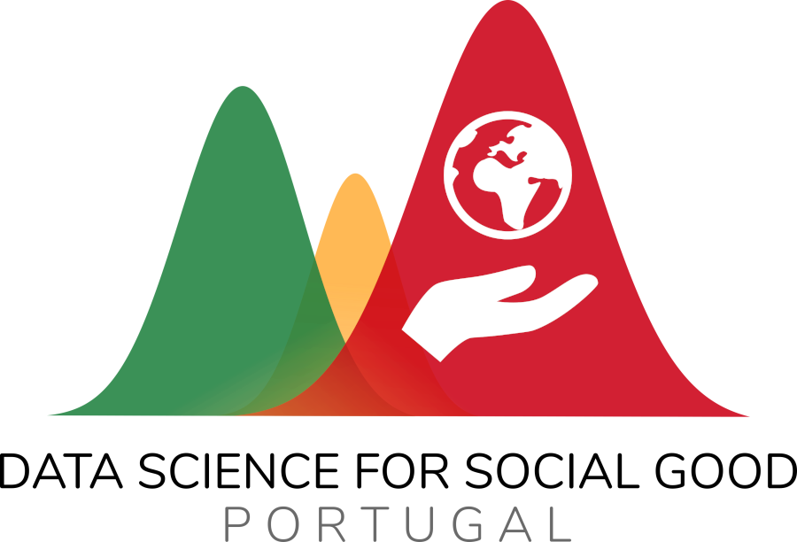

# 👶🚀 Mini-Projecto [NOME_FIXE_DO_MINI_PROJECTO] 

Este é o repositório do Mini-Projecto **[TODO: NOME_FIXE_DO_MINI_PROJECTO]**.

## 🤔 Contexto

**TODO**: Descrição breve do contexto (social, económico, tecnológico, dados, etc) em que se insere o Mini-Projecto.

## 🥅 Objectivo

**TODO**: Descrição breve do objectivo que se procura para o Mini-Projecto e dos benefícios que esse objectivo trará. 

## ⛲ Fontes de dados

**TODO**: Listagem e breve descrição das fontes de dados que alimentarão este projecto

+ Fonte de dados A 
+ Fonte de dados B
+ Fonte de dados C

## 🧱 Principais etapas

**TODO**: Uma listagem sumária dos principais pacotes de trabalho desde o dia 1 até a conclusão do Mini-Projecto.

+ Extrair coisas 
+ Transformar coisas
+ Aprender coisas

## 🎯 Resultado final esperado

**TODO**: Uma descrição mais técnica e fechada do resultado final concreto que se procura com este Mini-Projecto. 

## 👥 Equipa

Este Mini-Projecto está pensado para uma equipa com, no máximo, **TODO** pessoas. _Se necessário, descrever em poucas palavras os perfis (em termos de capacidades técnicas e áreas de trabalho) que se procuram_.

## ⏲️ Duração prevista

Dado o tamanho da equipa e os resultados finais descritos, este mini-projecto tem uma duração estimada de **TODO** semanas (com a alocação de algumas horas por semana por cada membro da equipa).

## 🔁 Reprodutibilidade

**TODO**: Ambientes virtuais, dependências, etc. 

# 👉 Chegaste aqui e queres juntar-te a este Mini-Projecto?

Vê a [#1](/../../issues/1).

--- 

## 📜 Sobre os Mini-Projectos

_Os Mini-Projectos são iniciativas da [DSSG PT](https://dssg.pt) em que uma pequena equipa de Voluntários trabalha de forma independente numa iniciativa concreta e a curto prazo que, baseada em dados abertos, visa gerar resultados valiosos para a sociedade em geral. A lista de Mini-Projectos activos pode ser [consultada no nosso GitHub](https://github.com/dssg-pt/)._
